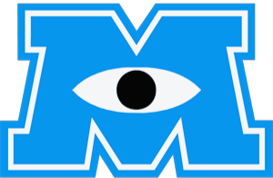

# Monster's University Academic Platform

The **official** web platform for Monster's University.  

## Table of contents

1. [About the project](#about-the-project)  
   1.1. [Built with](#built-with)
2. [Getting started](#getting-started)  
  2.1. [Installing Node.js](#installing-nodejs)  
  2.2. [Making a local repository of this project in your machine](#making-a-local-repository-of-this-project-in-your-machine)  
  2.3. [Running the project](#running-the-project)
3. [Usage](#usage)
4. [Contributors](#contributors)

## About the project

This project aims to equip the members of Monster's University with a platform that fully adjusts to their needs, whether they are student, teacher, manager or administrator, this plataform will come in handy and be of great value to each one of them.

### Built with
* [AdminLTE 3](https://adminlte.io/themes/v3/)
* [Bootstrap](https://getbootstrap.com/) 
* [Node.js](https://nodejs.org/en)

## Getting started

You must have [Git](https://git-scm.com/book/en/v2/Getting-Started-Installing-Git) installed in order to start this installation guide.  
Once you have that set up, we recommend you to follow this guide using [Visual Studio Code](https://code.visualstudio.com/) as your IDE.

### Installing Node.js 
1. Download the most recent version of Node.js from [this link](https://nodejs.org/en/download/prebuilt-installer).
2. After the `.msi` installer finishes downloading, run it and follow the installation process.
3. Choose the directory you want Node.js to be installed, this option will be available in the installation process.
4. On the *Custom Setup window*, click *Add to PATH* and then *Next*.
5. Check the checkbox on the *Tools for Native Modules* window and click *Next* to finish the installation.
6. In case it asks you for permissions, grant them. If not, then skip this step.

>[!NOTE]  
>To check if Node.js has been correctly installed, open **Windows Powershell** and run the command `npm -v`, which should output the installed version number.

### Making a local repository of this project in your machine
1. Position yourself in the directory where you want this project to be located.
2. Open cmd inside the directory you're located in, copy [this URL](https://github.com/andrwe455/MonsterUniversity) and use the `git clone` command followed by the URL.   
    > git clone https://github.com/andrwe455/MonsterUniversity  

    Alternatively, you can copy the command above and paste it into the console. 
3. You should see a folder named **MonsterUniversity** in the directory you ran the command on. Open this folder in visual studio code for the next steps.

### Running the project
1. After the project folder has been opened in Visual Studio Code, open the *TERMINAL*, type `npm install i` to install the necessary dependencies and press enter. The dependencies installation process might take a while so be patient 🧘‍♂️.
2. Type `npm start` to run the server.
3. In case Windows Firewall asks for permission, simply grant it. If not, then skip this step. 
4. You will see `http://localhost:3001` on the terminal. **Click** on it while also holding down **CTRL**.

## Usage
These are the e-mails for each role respectively. The password for each one of them is **123456**.

>manager@example.com *manager*   
student@example.com *student*  
teacher@example.com *teacher*  
admin@example.com *admin*

To close the server at any time, go back to Visual Studio Code, open the terminal, click on it and press **CTRL + C**

## Contributors
- Andrés Atehortua ([@andrwe455](https://github.com/andrwe455))
- Juan Sebastián Castro ([@nombre15](https://github.com/nombre15))
- Mariana Penagos ([@animewii](https://github.com/animewii))
- Yancarlos Cartagena ([@Yankarloz](https://github.com/Yankarloz))

